<h1 align="center">Instalação e Preparação de um Servidor Windows Server 2025</h1>

## Objetivo

Neste laboratório preparei uma máquina virtual com Windows Server 2025 utilizando o Oracle VirtualBox para servir de base aos próximos projetos do portfólio. A ideia foi preparar o ambiente que será utilizado nos próximos laboratórios, onde serão instaladas funções como Active Directory, DNS, DHCP e Group Policy.

## Tecnologias utilizadas

- Windows Server 2025 Datacenter Evaluation
- Oracle VirtualBox
- VirtualBox Guest Additions
- Windows Update

---

## Etapa 1 - Criação da Máquina Virtual

Criei uma máquina virtual com o nome **SRV-TI-01**, usando a ISO oficial do Windows Server 2025, que será reutilizada durante os próximos laboratórios. Configurei **4 GB de memória RAM**, **2 CPUs** e um **disco virtual dinâmico de 60 GB (VDI)**. 

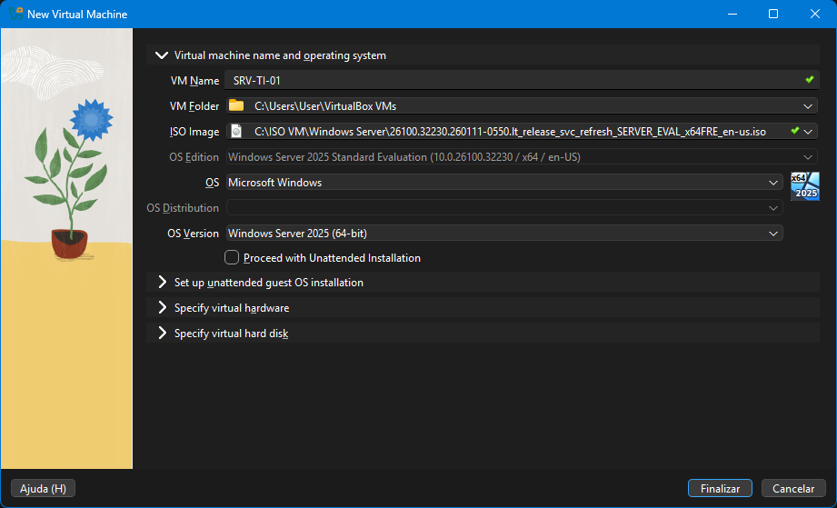

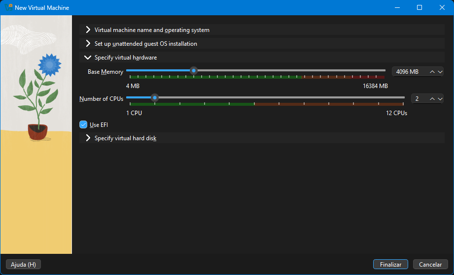

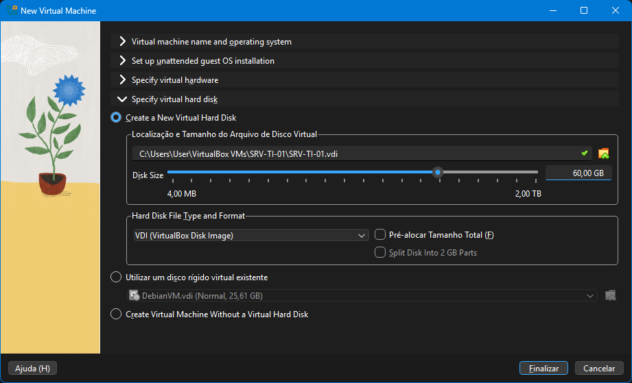

---

## Etapa 2 - Configuração das Interfaces de Rede

Antes de iniciar a instalação configurei duas placas de rede na máquina virtual.

O primeiro adaptador foi configurado em **NAT**, permitindo que o servidor tivesse acesso à Internet para baixar atualizações durante sua preparação e nos próximos laboratórios.

O segundo adaptador foi configurado como **Rede Interna** e recebeu o nome **"Lan"**. Essa interface será utilizada nos próximos laboratórios para criar uma rede isolada entre o Windows Server e as máquinas clientes, simulando uma rede interna semelhante à encontrada em ambientes corporativos.

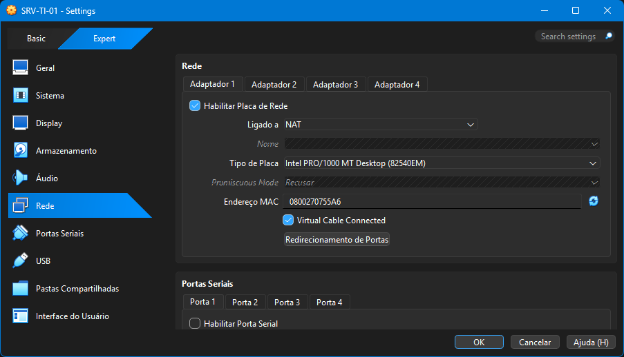

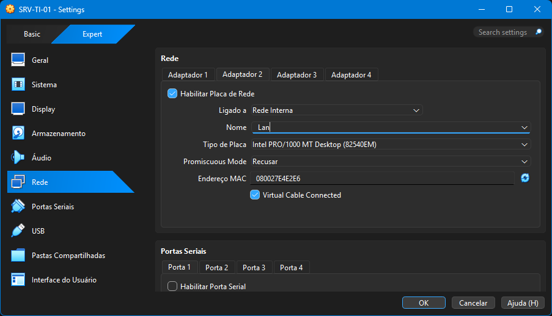

---

## Etapa 3 - Instalação do Windows Server

Após iniciar a máquina virtual utilizei o assistente de instalação do Windows Server para selecionar o idioma, escolher a edição **Windows Server 2025 Datacenter Evaluation (Desktop Experience)** e permitir que o instalador criasse automaticamente as partições do disco virtual.

Depois da cópia dos arquivos e do primeiro reinício, o Windows Server foi instalado com sucesso e ficou pronto para ser utilizado nos próximos laboratórios.

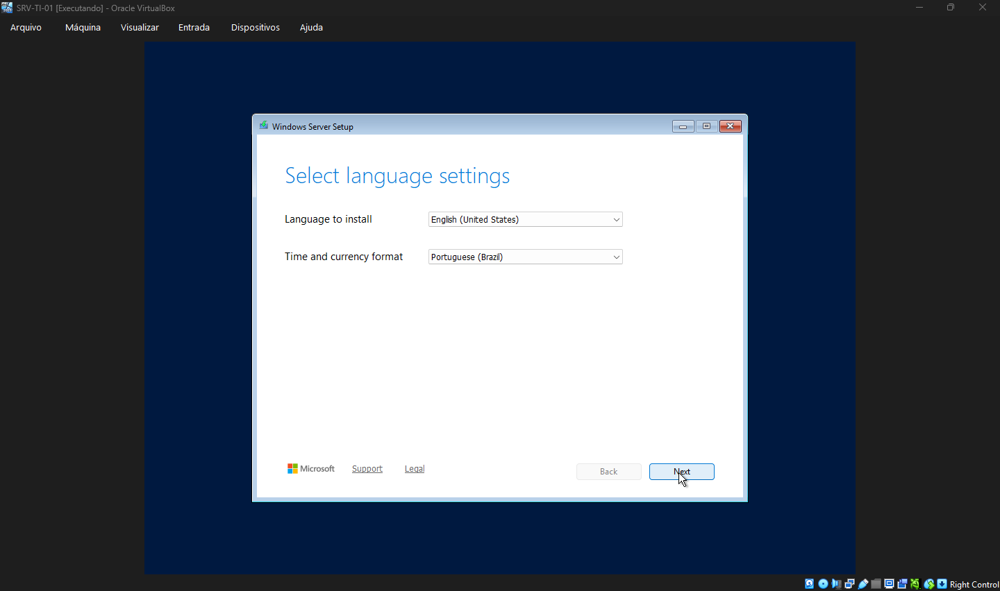

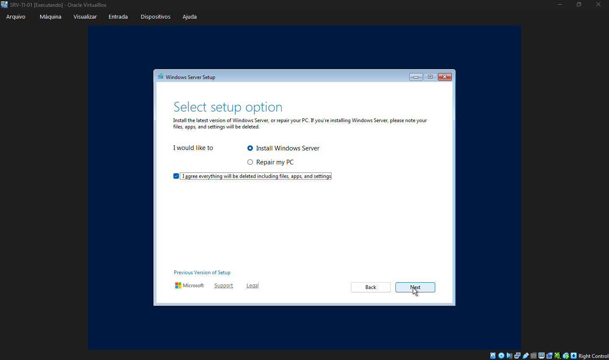

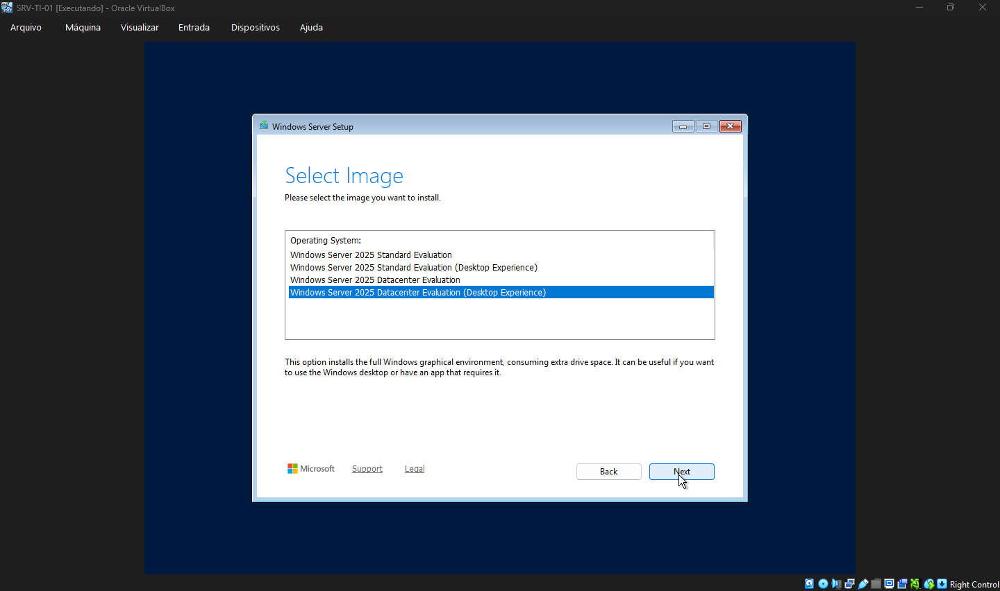

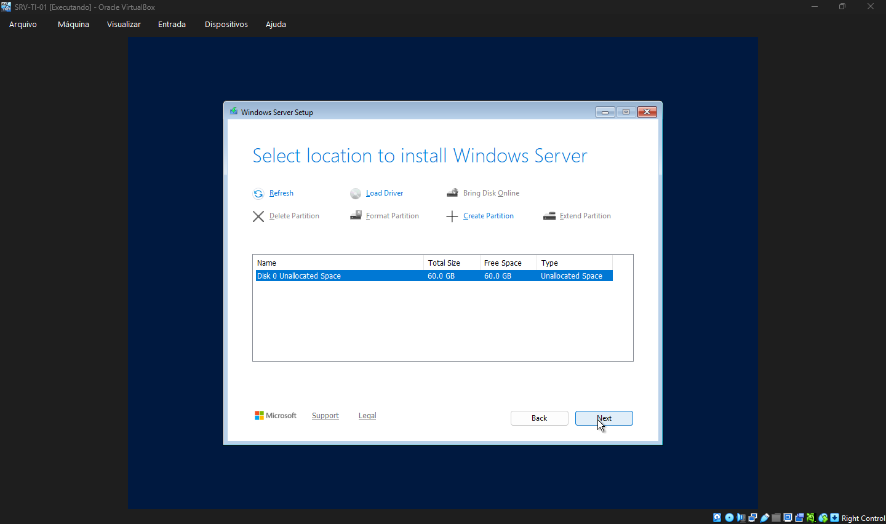

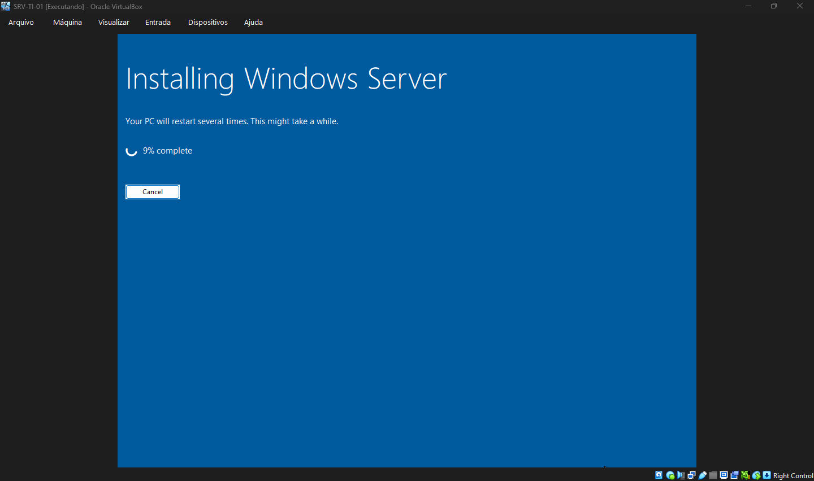

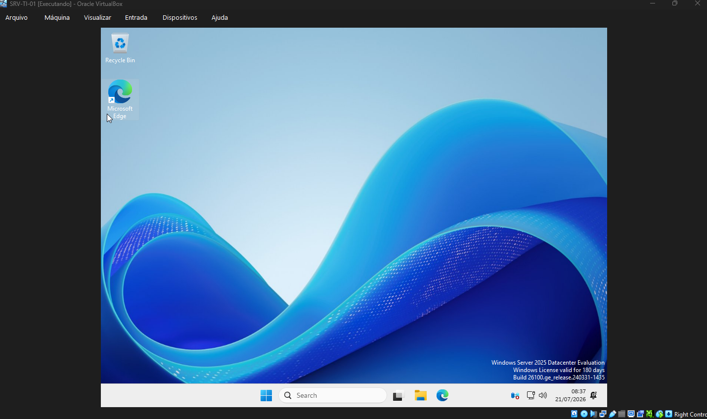

---

## Etapa 4 - Instalação do VirtualBox Guest Additions

Instalei o **VirtualBox Guest Additions**, adicionando recursos que facilitam o uso da máquina virtual, como melhor resolução de vídeo, integração do mouse e compartilhamento da área de transferência entre o sistema hospedeiro e o Windows Server.

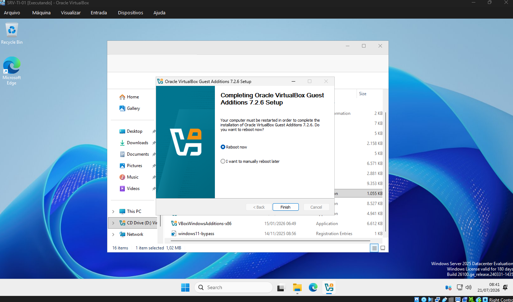

---

## Etapa 5 - Windows Update

Antes de utilizar o servidor nos próximos laboratórios executei o Windows Update até que todas as atualizações disponíveis fossem instaladas. Isso garante que a máquina virtual seja utilizada nos próximos laboratórios com o sistema operacional atualizado.

Não instalei nenhum aplicativo adicional na VM. Diferente de uma estação de trabalho, um servidor deve manter o mínimo de software possível. Cada programa a mais é superfície de ataque e consumo de recursos sem necessidade nesse estágio.

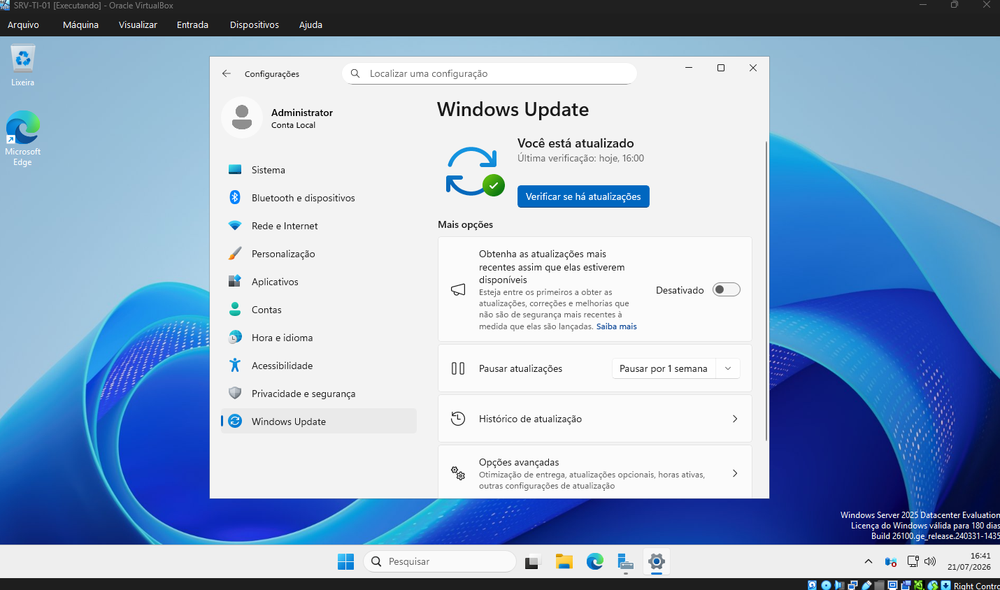

---

## Etapa 6 - Snapshot do Estado Inicial

Com toda a preparação concluída, criei um snapshot da máquina virtual para preservar esse estado inicial.

Esse snapshot servirá como ponto de restauração caso algum laboratório futuro exija voltar o servidor para uma condição limpa, evitando a necessidade de reinstalar todo o sistema operacional.

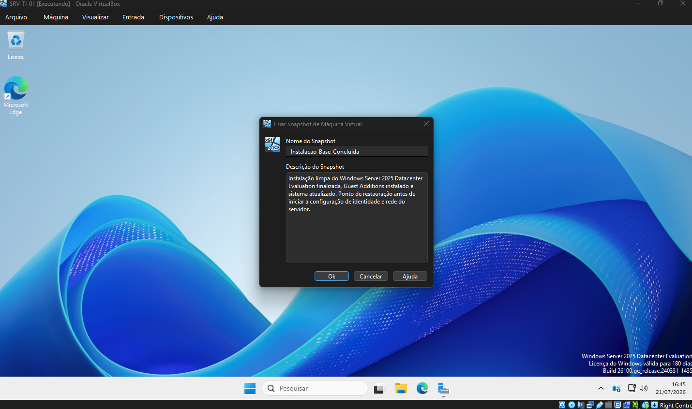

---

## Conclusão

Diferente da instalação de uma estação Windows 11, nesse ambiente a preocupação não é apenas instalar o sistema operacional, mas também preparar uma base que será reutilizada ao longo dos próximos laboratórios envolvendo Active Directory, DNS, DHCP e outros serviços do Windows Server.

Com essa preparação concluída, a máquina virtual está pronta para receber essas funções sem que seja necessário repetir toda a instalação do sistema operacional.

## Autor

**Arthur Fernandes**

Estudante de Ciência da Computação, em transição de carreira para a área de TI (Suporte Técnico, Infraestrutura, Redes e NOC).

**LinkedIn:**
[Arthur Fernandes](https://www.linkedin.com/in/arthur-fernandes-289395272)
